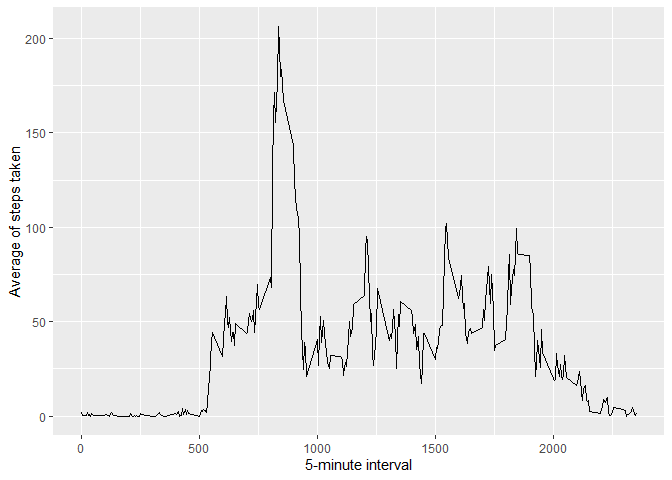

# Reproducible Research Assignment

## Analyzing data from activity trackers (steps in 5 min intervals)

## First, we will load the data after loading the necesssary packages


```r
library(ggplot2)
library(scales)
library(Hmisc)
```

```
## 
## Attaching package: 'Hmisc'
```

```
## The following objects are masked from 'package:base':
## 
##     format.pval, units
```


```r
if(!file.exists('activity.csv')){unzip('activity.zip')
}
dataSet <- read.csv('activity.csv')
str(dataSet)
```

```
## 'data.frame':	17568 obs. of  3 variables:
##  $ steps   : int  NA NA NA NA NA NA NA NA NA NA ...
##  $ date    : chr  "2012-10-01" "2012-10-01" "2012-10-01" "2012-10-01" ...
##  $ interval: int  0 5 10 15 20 25 30 35 40 45 ...
```
## Now, we will find the mean number of steps taken per day.

 find total number of steps taken per day


```r
total_steps <- tapply(dataSet$steps, dataSet$date, sum, na.rm=TRUE)
```

Making a Histogram of the data

```r
qplot(total_steps, xlab='Total steps per day',
      ylab='Frequency using binwith 500', binwidth=500)
```

```
## Warning: `qplot()` was deprecated in ggplot2 3.4.0.
```

<!-- -->

Calculate the daily mean and median of steps

```r
dailymeansteps <- mean(total_steps)
dailymediansteps <- median(total_steps)
```

Mean = 9354.23, Median = 10395

## Observing the daily activity pattern through a time series plot
## define daily activity


```r
avgdailyact <- aggregate(x=list(meanSteps=dataSet$steps),
                         by=list(interval=dataSet$interval),
                         FUN=mean, na.rm=TRUE)
```

Next, create a time series plot, witj 5-minute intervals (x-axis),
and the average number of steps taken, averaged acorss all of the days

```r
ggplot(data=avgdailyact, aes(x=interval, y=meanSteps)) + geom_line() + 
     xlab("5-minute interval") + ylab("Average of steps taken")
```

<!-- -->

Now, we will fidn the 5-minute interval with the highest average amount of
steps, taken acorss the entire dataset


```r
moststeps <- which.max(avgdailyact$meanSteps)
timemoststeps <-  gsub("([0-9]{1,2})([0-9]{2})", "\\1:\\2",
                       avgdailyact[moststeps,'interval'])
```

835th "5-minute interval" in the time series plot

## Time to address the missing values!

First, we will calculate the number of NAs

```r
missvals <- length(which(is.na(dataSet$steps)))
```

Missing Values: 2304 

We will create a histogram, then calculate the median and mean. By comparing
these results to the first part of this assignment when we did not address, the
missing values, we can observe the effect of filling NAs with  mean and median


```r
DSI <- dataSet
DSI$steps <- impute(dataSet$steps, fun=mean)
```
Creating Histogram...

```r
I <- tapply(DSI$steps, DSI$date, sum)
qplot(I, xlab='Total steps per day (Imputed)',
      ylab='Frequency using binwith 500', binwidth=500)
```

<!-- -->

Now, we will calculate the mean and median.c

```r
dMeanImp <- mean(I)
dMedImp <- median(I)
```

Mean = 10766.19, Median = 10766.19

These results tell me that in this particular case, adding the mean or median
made no apparent difference in the analysis. That is not to say it is not
important to address them!

## Lastly, we want to observe the difference, if any, in activity patterns 
## between weekends and weekdays. We will be using a panel plot to visualize
## the potential differences. Let's check it out!

First, let's create a new factor in the dataset, separating weekdays & weekends

```r
DSI$dateType <-  ifelse(as.POSIXlt(DSI$date)$wday %in% c(0,6),
                        'weekend', 'weekday')
```

Next, let's make the panel plot (comparing two time-series plots)using the
facet aspect of ggplot

```r
AVG <- aggregate(steps ~ interval + dateType, data=DSI, mean)
ggplot(AVG, aes(interval, steps)) + geom_line() + facet_grid(dateType ~ .) + xlab("5-minute interval") + ylab("avarage number of steps")
```

<!-- -->
This panel plot gives us a good idea of the different averages of step numbers throughout the day, when comparing weekdays to weekends. While the general shape of the plots are similar, there are higher measures of activity during the week, specifically with an earlier start being indicated by weekday 5-minute intervals. In addition, the average activity throughout the middle intervals of the time-series plots appears to be higher, indicating more average steps early in the morning, and throughout the day.
